# 项目简介

​	你说的对，但是《智能在线文档编辑器》是由36小组自主研发的一款全新编辑器。故事发生在一个被称作「重大」的魔幻世界，在这里，被神选中的人将被授予「实训」，导引代码之力。你将扮演一位名为「码农」的神秘角色。在自由的旅行中邂逅性格各异、能力独特的同伴们，和他们一起击败实训，找回失散的分数——同时，逐步发掘「重大」的真相。

## 功能介绍

**功能一：智能润色**

1. 在功能上：利用大语言模型，根据上下文，实现如摘要、修饰、续写、病句改写、翻译等等常见写作辅助功能；

2. 在交互形式上：需要考虑到不同能力的整合、管理与切换，降低用户选择负担。

**功能二：多媒体信息提取**

1. 在功能上：利用OCR、目标检测和语音识别等多模态感知技术，实现对图像（如截图、海报、PDF等）、语音甚至视频等多媒体信息的在线信息提取，并能允许用户将内容有机整合到编辑器中。

2. 在交互形式上：能够有效的管理和检索多模态数据。

**功能三：智能格式排版**

1. 在功能上：根据内容类型识别，自动进行格式排版，如自动调整字体、字号、行间距等，同时提供多种排版模板供用户选择。

2. 在交互形式上：注重样式库的管理和二次编辑。

**非功能性需求：用户体验**

**用户体验：**网站运行无卡顿，有较好的流畅度。

# 项目结构

--Codes（系统开发）

​	--（工程代码）

​	--（测试文档）

--Result（交付验收）

--Project_Management（项目管理与任务分工）

​	--里程碑计划（里程碑计划甘特图）

​	--模块与任务分工（任务分工）

--Sys_Design（系统设计）

​	--Ana_Design（需求设计）

​	--Detailed_Design（详细设计）

​	--Outline_Design（概要设计）

--Rolling_Project（项目滚动开发日志）

​	--picture（存放开发日志截图）

# 项目开发日志

## Day: 2024/6/24

​	学习项目需求设计方法，编写需求设计文档

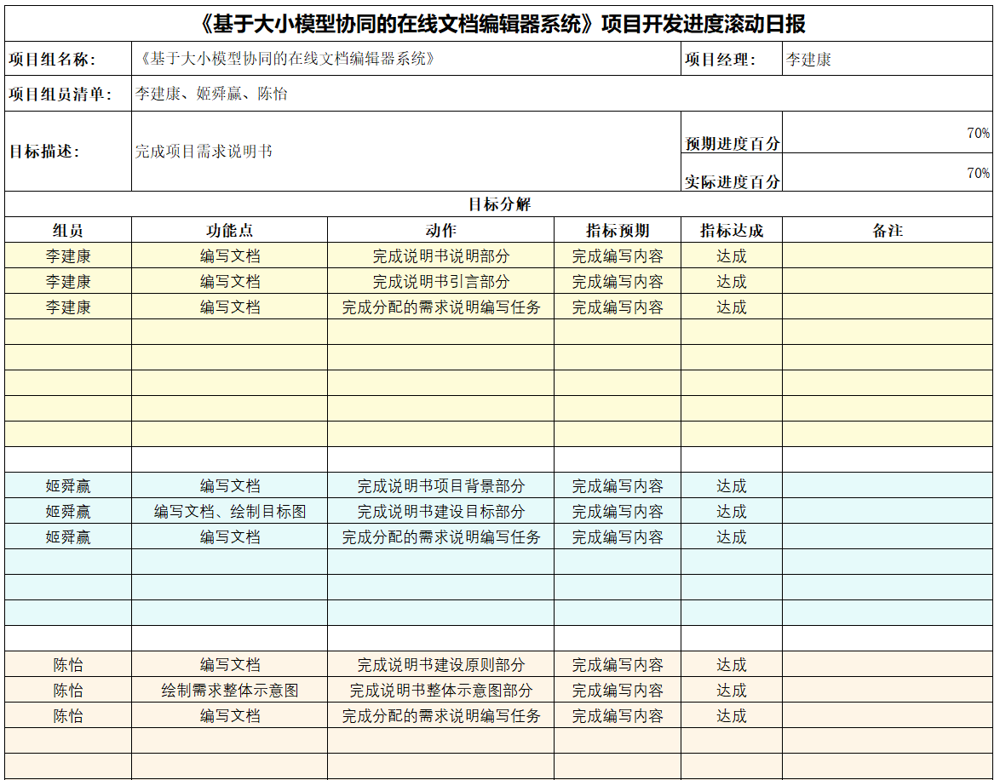

## Day: 2024/6/25

​	完善需求设计文档，学习Git使用方法，创建并使用Git仓库

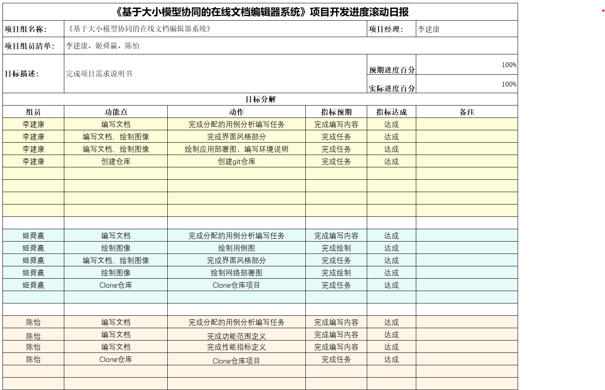

## Day: 2024/6/26

​	编写概要设计文档，学习详细设计文档编写方法

## Day: 2024/6/27

​	完善概要设计文档

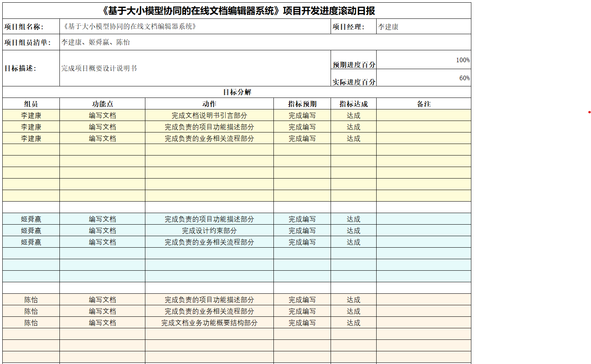

## Day: 2024/6/28

​	完成详细设计文档

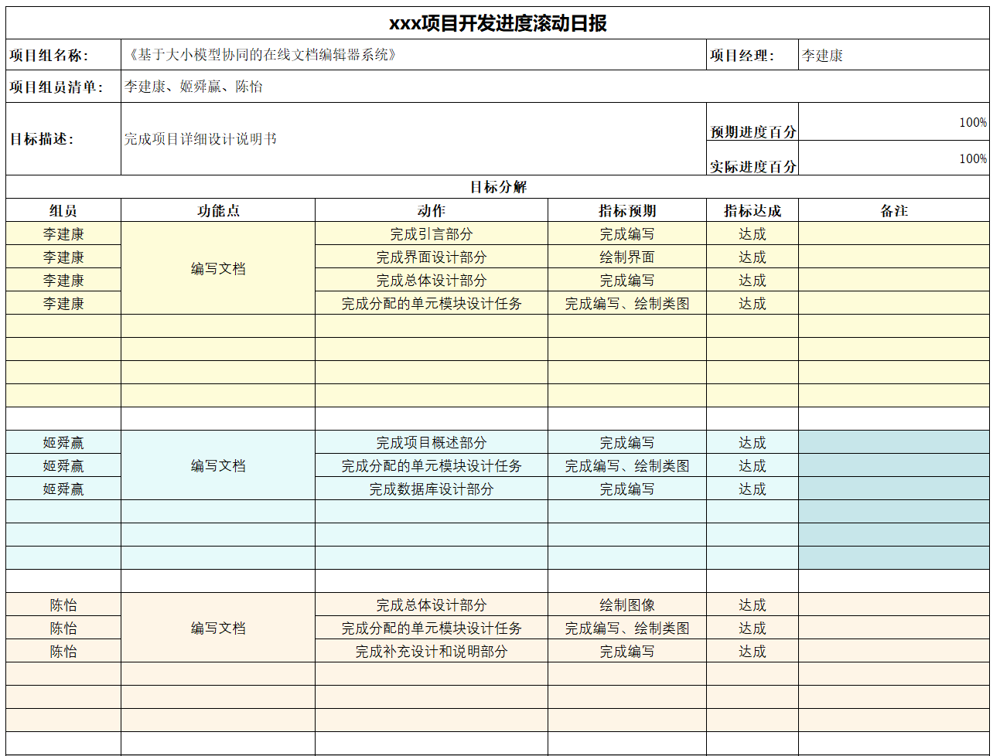

## Day: 2024/7/1

​	搭建开发环境，任务和模块进行分工

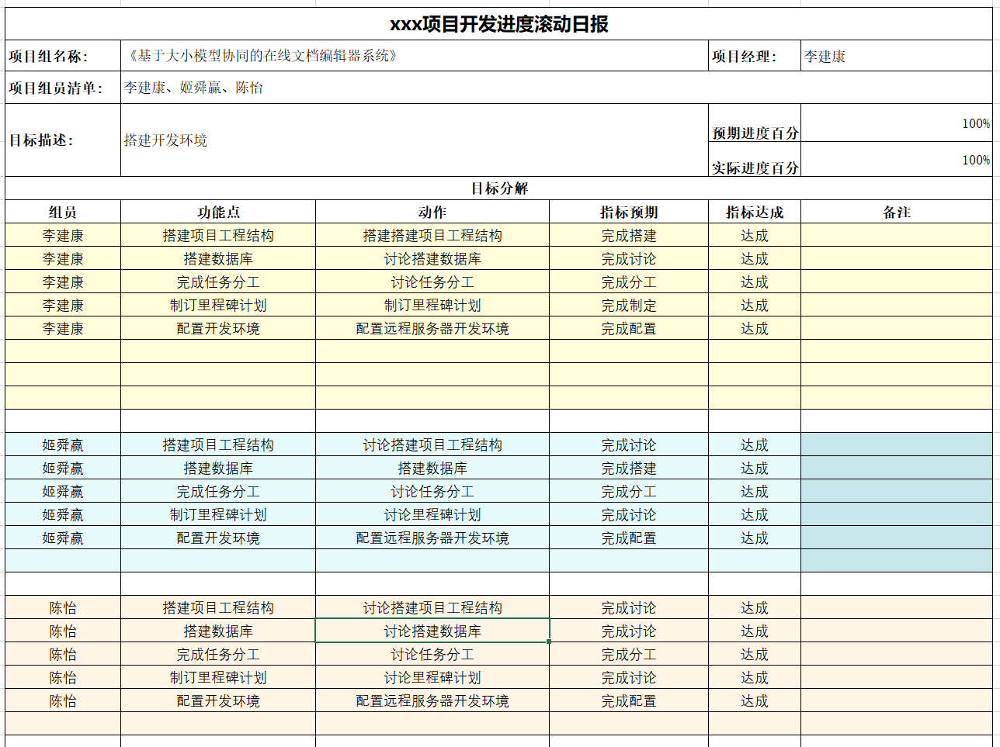

## Day: 2024/7/2

​	学习Vue开发，搭建前端整体框架

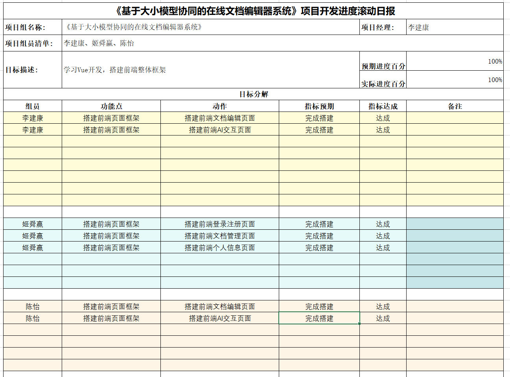

## Day: 2024/7/3

​	根据搭建的前端框架，精细化实现组件和功能

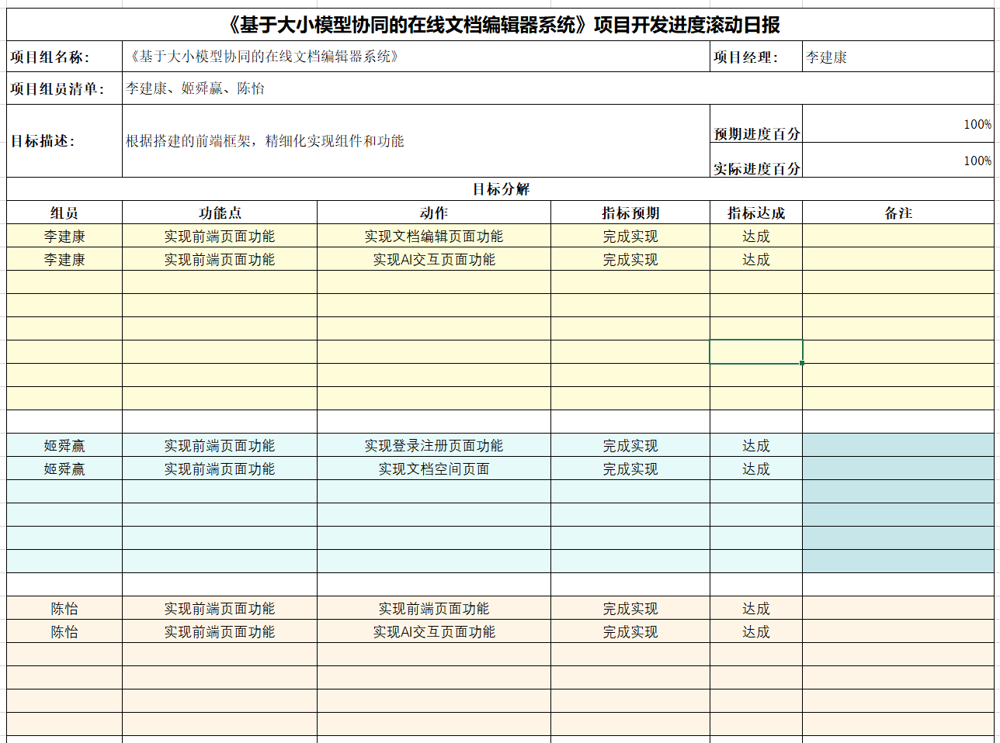

## Day: 2024/7/4

​	根据搭建的前端框架，精细化实现组件和功能（和昨天一样）

## Day: 2024/7/5

​	根据搭建的前端框架，精细化实现组件和功能（和昨天一样）

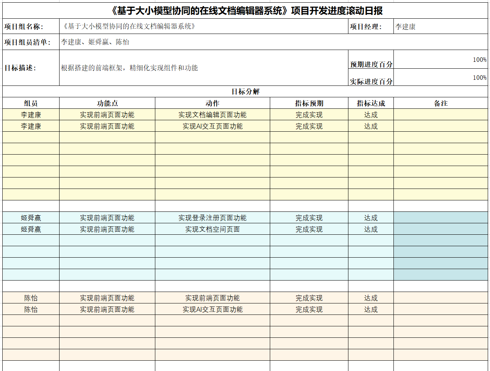

## Day: 2024/7/8

​	完善项目功能

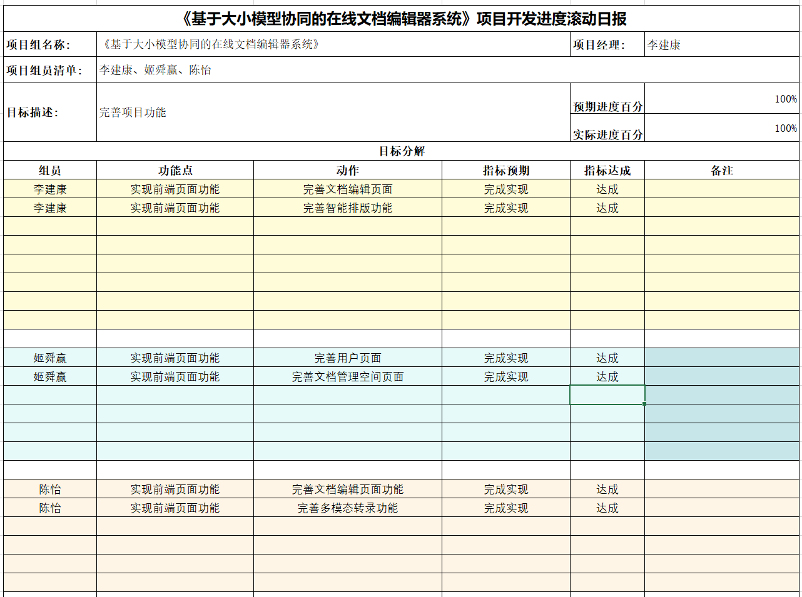

## Day: 2024/7/9

​	合并各人的项目代码，实现前后端和数据库的连接

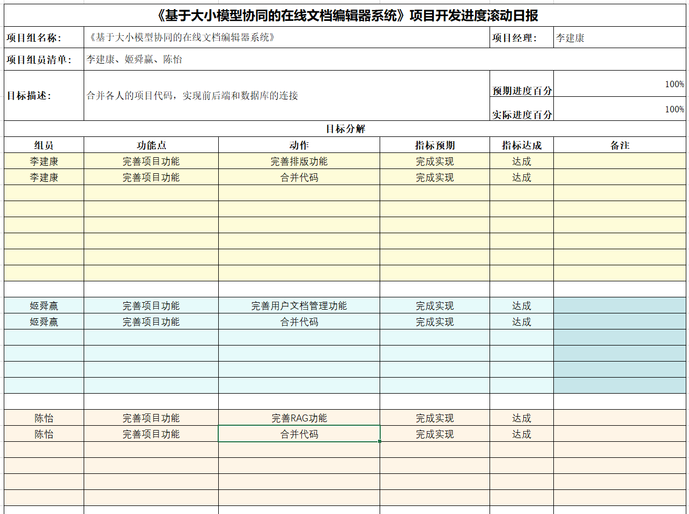

## Day: 2024/7/10

​	合并各人的项目代码，完善项目功能

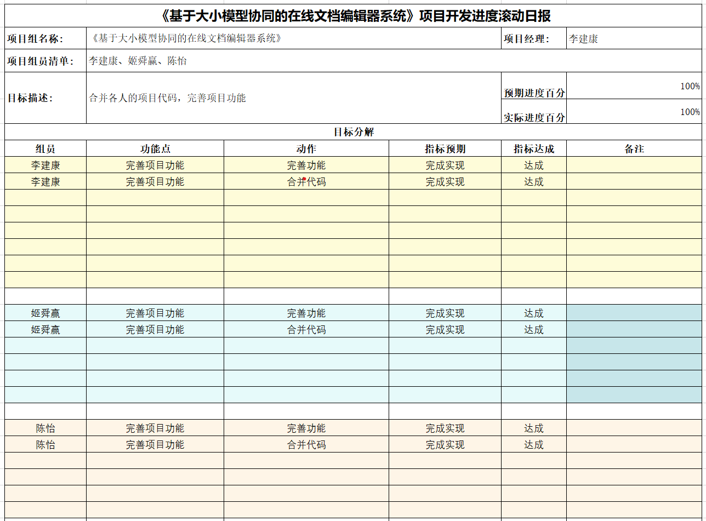
